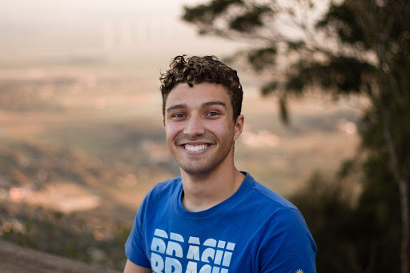
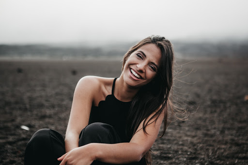

# Personas

## **Zuko Firenation**

### Stats
- 18 years old, Freshman UW student
- Lives in Willow Hall on campus
- Originally from Phoenix, Arizona
- Marine Biology major

### Community Service History
- Not a lot of community service experience
- Started doing community service in high school as part of Honor Society requirements
- Volunteered in a couple of community service events to meet new people

### Goals
- Find a group of friends to hang out with
- Explore and become more familiar with the Seattle area

### Pain points
- Struggles to find community at UW
- Does not know where to find information and events for community service at UW

## **Katara Watertribe**

### Stats:
- 21 years old, Senior UW student
- Lives in apartment near campus
- Originally from the Bay Area
- Environmental studies major

### Community Service History:
- Has volunteered for community service since middle school
- Leads RSOs focused on environmental conservation and awareness
- Is currently a part of APO, a co-ed service fraternity

### Goals:
- Raise awareness of how trash affects oceans and beaches
- Find new members to expand her RSO

### Pain points:
- Motivating members to try out different service opportunities
- Difficulty finding and choosing events for members to find on the RSO service calendar
