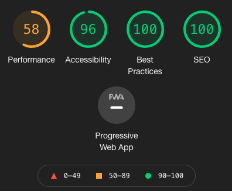

# Testing

## **Visual Testing on Chrome**

Having a live server of the app in development open at all times while changing code was crucial. Using developer tools to navigate through the DOM after React rendered the components, find console and error messages to locate potential problems in our app and test our app on multiple different screen sizes and input devices (laptop, desktop, phone & tablet).

## **Chrome Lighthouse**

### Accessibility

Testing our aria attributes and other features of our site that were focused towards accessibility

### Best Practices

Our use of React did the most of the heavy lifting of keeping our app modern and running as expected.
